# Universidad Técnica de Ambato
## Facultad de Ingeniería en Sistemas, Electrónica e Industrial
### Carrera de Software
**Asignatura:** Manejo y Configuración de Software
**Nombre del Estudiante:** Solis Salinas Mario Tomas
**Fecha:** 08/04/2026
---

# Evaluación Práctica de Git y GitHub

## Instrucciones Generales

- Cada pregunta debe ser respondida directamente en este archivo **(README.md)** debajo del enunciado correspondiente. 
- Es importante que se coloque capturas de pantalla como evidencia de la parte práctica. Se recomienda crear una carpeta `images/` para almacenar las capturas de pantalla.
- Cada respuesta debe ir acompañada de uno o más **commits**, según se indique en cada pregunta.
- Cuando se indique, deberán realizarse acciones prácticas dentro del repositorio (como creación de archivos, ramas, resolución de conflictos, etc.).
- Cada pregunta debe estar **etiquetada con un tag**, únicamente en el commit final correspondiente, con el formato: `"Pregunta 1"`, `"Pregunta 2"`, etc.

---

## Pregunta 1 (1 punto)

**Explicar la diferencia entre los siguientes conceptos/comandos en Git y GitHub:**

- `git clone`  
- `fork`  
- `git pull`

### Parte práctica:

- Realizar un **fork** de este repositorio en la cuenta personal de GitHub del estudiante.
- Luego, realizar un **clone** del fork en el equipo local.
- En este README, describir el proceso seguido:
  - ¿Cómo se realizó el fork?
  - ¿Cómo se realizó el clone del fork?
  - ¿Cómo se verificó que se estaba trabajando sobre el fork y no sobre el repositorio original?
- Realizar en la rama `main` todo lo que corresponde a esta pregunta.

**📝 Respuesta:**

**git clone:** Descarga una copia del repositorio remoto a tu computadora local.
**fork:** Crea una copia del repositorio en tu propia cuenta de GitHub.
**git pull:** Descarga y fusiona los cambios del repositorio remoto al local.

**¿Cómo se realizó el fork?**
Se ingresó al repositorio original y se hizo clic en el botón Fork, seleccionando la cuenta THThoms.
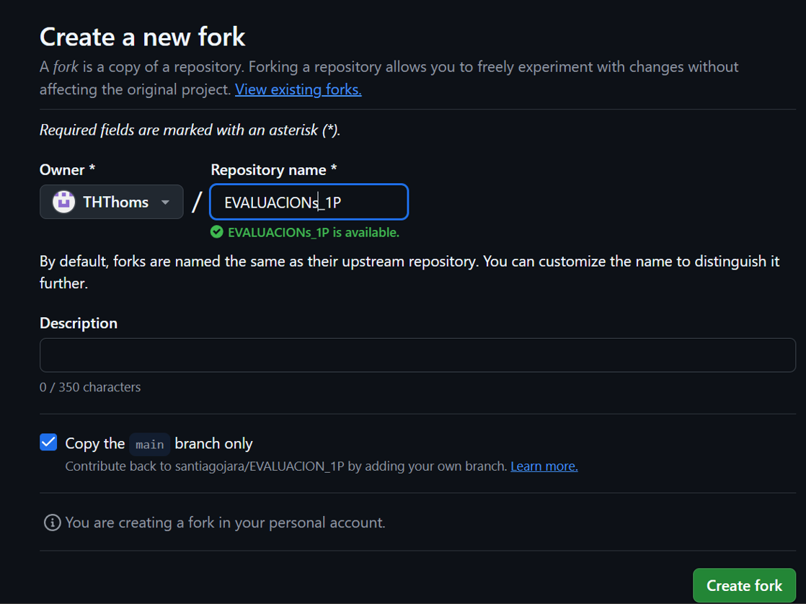

**¿Cómo se realizó el clone?**
Se ejecutó el comando git clone con la URL del fork personal.
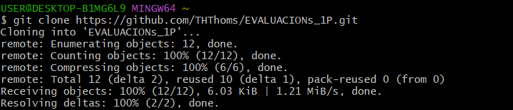

**¿Cómo se verificó que era el fork?**
Se ejecutó git remote -v y mostró la URL con el usuario THThoms.
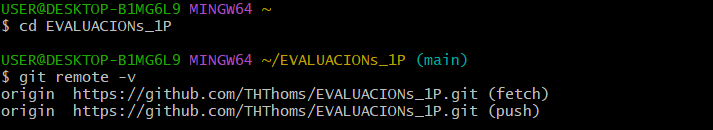

---

## Pregunta 2 (1 punto)

**Configurar un archivo `.gitignore` para que ignore:**

- Todos los archivos con extensión `.log`.
- Una carpeta llamada `temp/`.
- Todos los archivos `.md` y `.txt`de la carpeta `doc/`. (Probar agregando un archivo `prueba.md` y un archivo `prueba.txt` dentro de la carpeta y fuera de la carpeta.)

### Requisitos:

1. Realizar un **primer commit** que incluya únicamente el archivo `.gitignore` con las reglas de exclusión definidas.
2. Realizar un **segundo commit** que incluya las creación de los archivos de prueba.
2. Realizar un **tercer commit** donde se explique en este README la función del archivo `.gitignore` y se muestre evidencia de que los archivos y carpetas indicadas no están siendo rastreadas por Git.

**Importante:**  
- Solo el **tercer commit** debe llevar el **tag `"Pregunta 2"`**.

**📝 Respuesta:**

📝 Respuesta:

El archivo .gitignore le indica a Git qué archivos y carpetas NO debe 
rastrear ni incluir en los commits.

Reglas configuradas:
- *.log → ignora todos los archivos con extensión .log (ej: error.log)
- temp/ → ignora la carpeta temp/ y todo su contenido
- doc/*.md → ignora archivos .md dentro de la carpeta doc/
- doc/*.txt → ignora archivos .txt dentro de la carpeta doc/

Los archivos prueba.md y prueba.txt creados FUERA de doc/ sí son 
rastreados por Git. Los mismos archivos DENTRO de doc/ son ignorados.

Evidencia del archivo .gitignore:
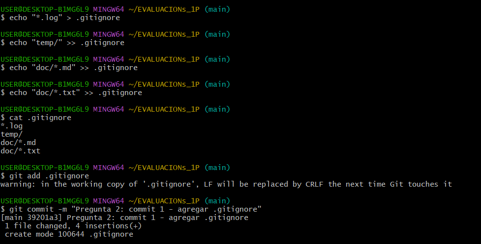

Evidencia de git status mostrando archivos ignorados:
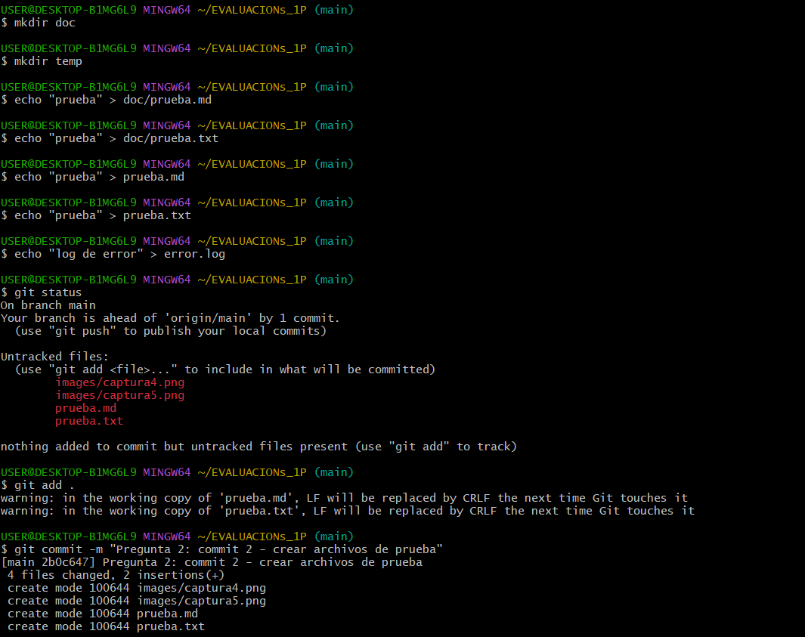
---

## Pregunta 3 (2 puntos)

**Utilizar Git Flow para desarrollar una nueva funcionalidad llamada `ingresar-encabezado`.**

### Requisitos:

- Inicializar el repositorio con Git Flow, utilizando las ramas por defecto: `main` y `develop`.
- Crear una rama de tipo `feature` con el nombre `ingresar-encabezado`.
- En dicha rama, **completar con los datos personales del estudiante** el encabezado que ya se encuentra al inicio de este archivo `README.md`.
- Realizar al menos un commit durante el desarrollo.
- Finalizar el hotfix siguiendo el flujo de trabajo establecido por Git Flow.

### En la sección de respuesta, se debe incluir:

- Los **comandos exactos** utilizados desde la inicialización de Git Flow hasta el cierre de la rama.
- Una descripción del **proceso seguido**, indicando el propósito de cada paso.
- Una reflexión sobre las **ventajas de aplicar Git Flow**, especialmente en contextos colaborativos o proyectos de larga duración.

**Importante:**

- Deben realizarse varios commits durante esta pregunta.
- **Solo el commit final** debe llevar el **tag `"Pregunta 3"`**.
- El flujo debe respetar la estructura de Git Flow con las ramas `develop` y `main`.

**📝 Respuesta:**

Comandos utilizados:
1. git flow init → inicializa Git Flow con ramas main y develop
2. git flow feature start ingresar-encabezado → crea rama feature
3. git add . / git commit → commits durante el desarrollo
4. git flow feature finish ingresar-encabezado → merge a develop y elimina la rama

Ventajas de Git Flow:
- Permite trabajar en nuevas funcionalidades sin afectar main
- Organiza el trabajo en equipo con ramas definidas
- Facilita el control de versiones en proyectos largos

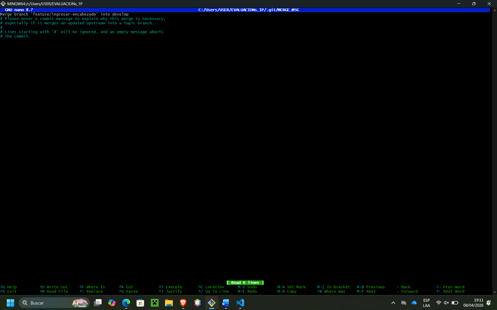

---

## Pregunta 4 (2 puntos)

**Trabajo con Issues y Pull Requests**

### Parte teórica:

- ¿Qué es un Pull Request y cuál es su función dentro de un flujo de trabajo colaborativo con Git y GitHub?
- ¿Por qué es importante revisar un Pull Request antes de fusionarlo con la rama principal?
- ¿Qué tipo de observaciones o validaciones se suelen realizar durante la revisión de un Pull Request?

### Parte práctica:

- Trabajar en la rama `develop`, ya existente desde la configuración de Git Flow.
- Realizar los cambios necesarios en este archivo `README.md` para responder las preguntas.
- Realizar un **commit** con los cambios de la primera pregunta y subirlo a la rama `develop` del repositorio remoto.
- Crear un **pull request** desde `develop` hacia `main` en GitHub, con el nombre `"Pregunta 4 - Apellido Nombre"`.
- Crear comentarios solicitando: 1. que se agregue la respuesta de la segunda pregunta y luego agregando la respuesta con el respectivo commit; y 2. el mismo procedimiento para la tercera pregunta.
- **Aprobar** el pull request para que se haga el merge respectivo hacia `main`.

### En la sección de respuesta, se debe incluir:

- Un resumen del procedimiento realizado con las respectivas preguntas y capturas.
- El número y enlace al pull request.
**📝 Respuesta:**

**¿Qué es un Pull Request?**
Es una solicitud para fusionar cambios de una rama hacia otra. 
Permite revisar el código antes de integrarlo a la rama principal.

**¿Por qué es importante revisarlo?**
Para verificar que el código no tenga errores y cumpla con 
los estándares del proyecto antes de fusionarlo.

**¿Qué validaciones se hacen?**
- Revisión de código
- Verificación de conflictos
- Pruebas de funcionamiento
- Comentarios y sugerencias

**Procedimiento práctico:**
1. Se trabajó en rama develop respondiendo las preguntas teóricas.
2. Se hizo commit y push a develop.
3. Se creó un Pull Request desde develop hacia main.
4. Se agregaron comentarios solicitando respuestas de Preguntas 2 y 3.
5. Se aprobó y se hizo merge del PR hacia main.

**Enlace al Pull Request:** 
https://github.com/THThoms/EVALUACIONs_1P/pull/1

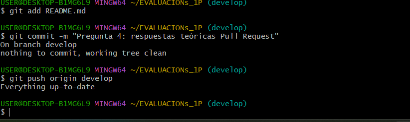
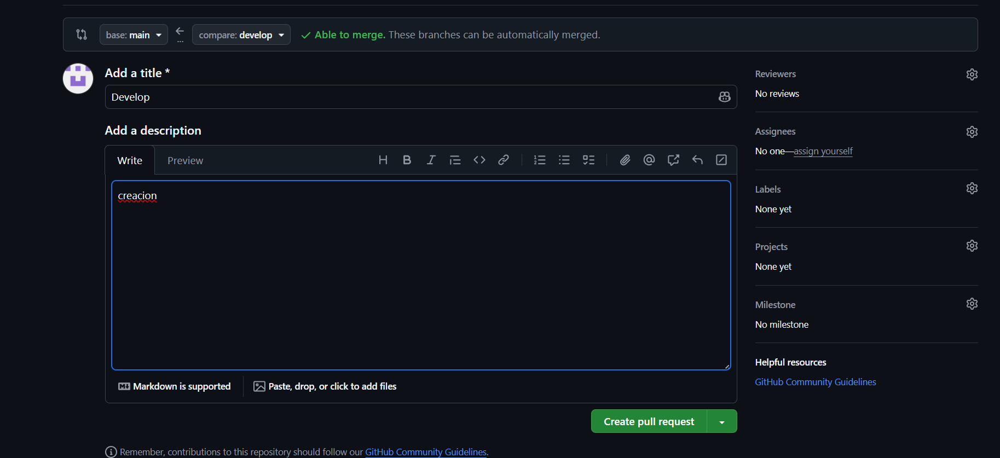
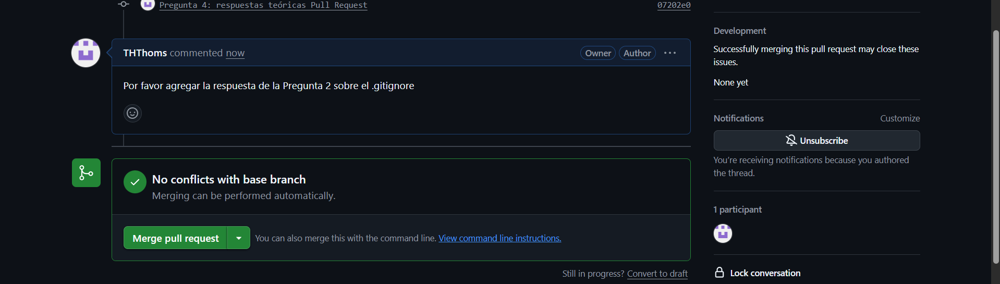
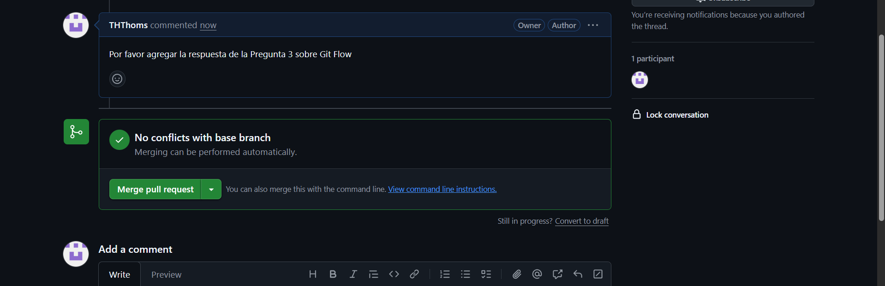
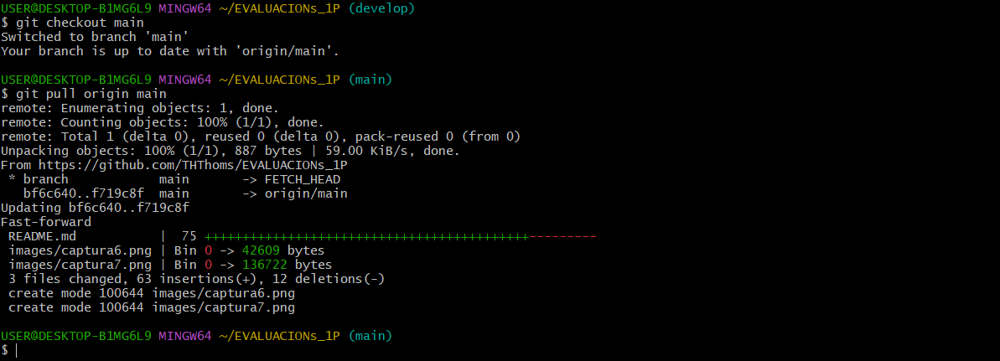
---

## Pregunta 5 (2 puntos)

**Resolver conflictos entre ramas y realizar un Pull Request**

### Requisitos:

- Crear dos ramas llamadas `ramaA` y `ramaB`, ambas a partir de la rama `develop`.
- En `ramaA`, crear un archivo llamado `archivoA.txt` con el contenido:  
  `Contenido A`
- En `ramaB`, crear un archivo con el mismo nombre (`archivoA.txt`), pero con el contenido:  
  `Contenido B`
- Intentar fusionar `ramaB` sobre `ramaA`, lo cual debe generar un conflicto.
- Resolver el conflicto combinando ambos contenidos.
- Realizar el merge de `ramaA` hacia `develop`.
- Crear un **pull request** desde `develop` hacia `main`.
- Una vez completado lo anterior, eliminar las ramas `ramaA` y `ramaB`.

### En la sección de respuesta, se debe incluir:

- El procedimiento completo:
  - Cómo se crearon las ramas.
  - Cómo se generó y resolvió el conflicto.
  - Cómo se realizó el merge hacia `develop`.
  - Cómo se eliminaron las ramas al finalizar.
- El enlace al pull request.
- Una breve explicación de qué es un conflicto en Git y por qué ocurrió en este caso.

📝 Respuesta:

**¿Qué es un conflicto en Git?**
Un conflicto ocurre cuando dos ramas modifican el mismo archivo 
de forma diferente y Git no puede fusionarlas automáticamente.
En este caso ocurrió porque ramaA y ramaB crearon el mismo 
archivo archivoA.txt con contenido diferente.

**Procedimiento:**

1. Creación de ramas:
git checkout develop
git checkout -b ramaA
git checkout develop
git checkout -b ramaB

2. Se generó el conflicto al hacer:
git checkout ramaA
git merge ramaB

3. Se resolvió editando archivoA.txt combinando ambos contenidos:
Contenido A
Contenido B

4. Merge de ramaA hacia develop:
git checkout develop
git merge ramaA

5. Se eliminaron las ramas:
git branch -d ramaA
git branch -d ramaB

**Enlace al Pull Request:**
https://github.com/THThoms/EVALUACIONs_1P/pull/2

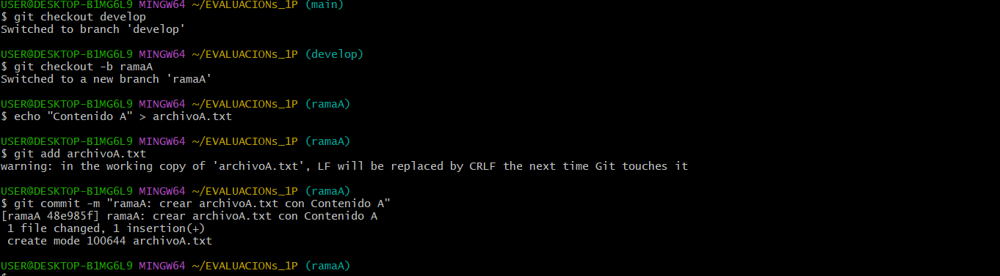
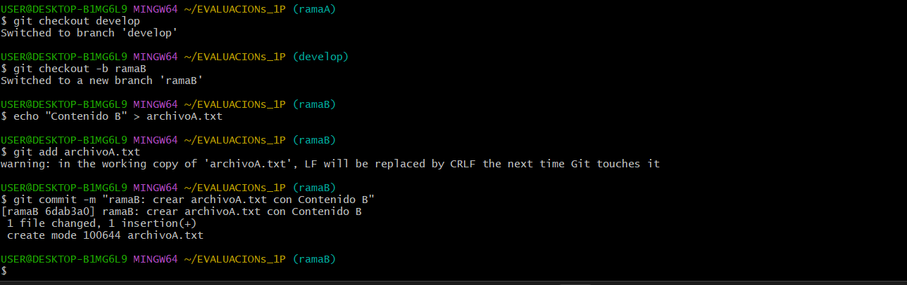
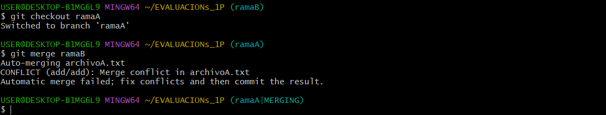
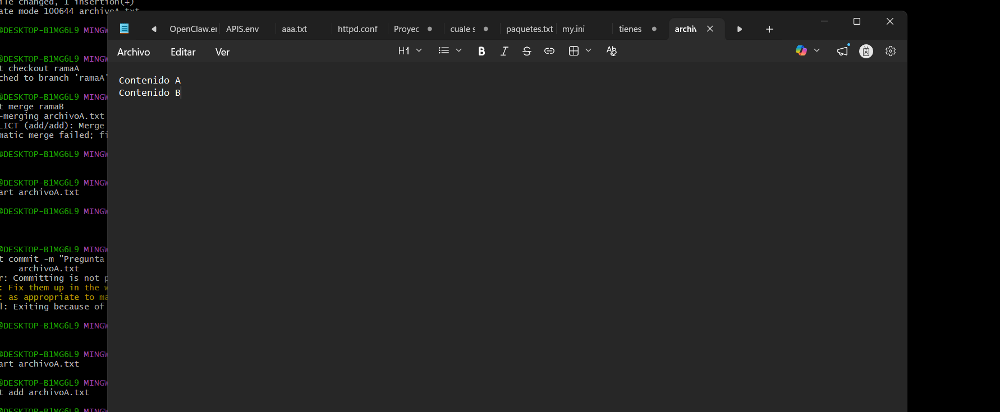
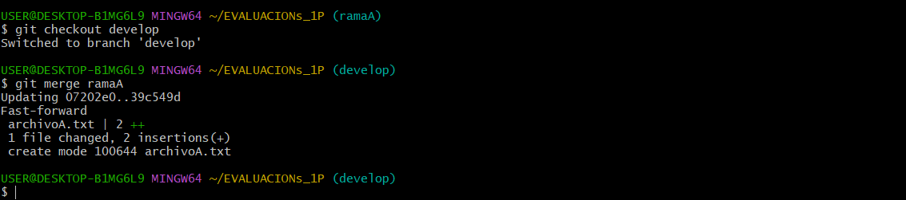
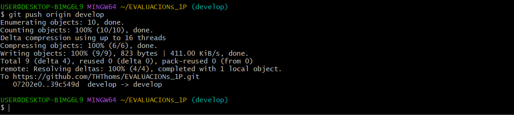
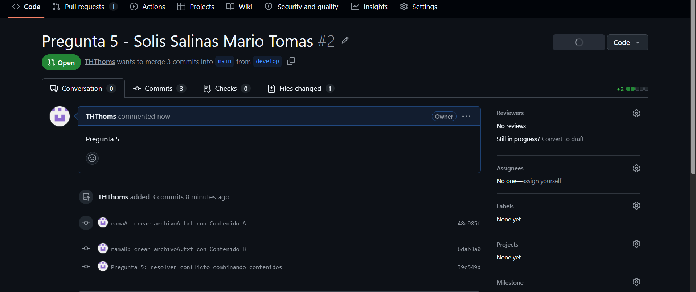
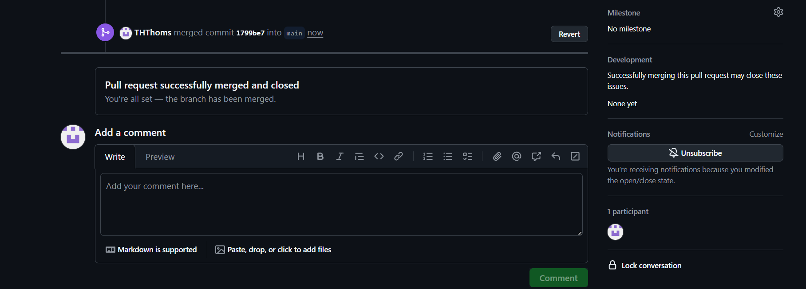
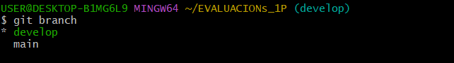

---

## Pregunta 6 (2 puntos)

**Realizar limpieza, explicar versionamiento semántico y enviar cambios al repositorio original**

### Requisitos:

- Trabajar en la rama `develop` del fork del repositorio.
- Eliminar los archivos `archivoA.txt` y `archivoB.txt` creados en preguntas anteriores.
- Realizar un merge desde `develop` hacia `main` en el repositorio local.
- Enviar los cambios de la rama `main` local a la rama `develop` del repositorio remoto (fork). Recuerde incluir todos los tags creados (6 tags).
- Finalmente, crear un **pull request** desde la rama `develop` del fork hacia la rama `main` del repositorio original (del cual se realizó el fork en la Pregunta 1). El titulo del pull request debe ser `"NOMBRE APELLIDOS"`, en la descripción colocar el link de su repositorio de GitHub.

### En la sección de respuesta, se debe incluir:

- Una explicación del proceso realizado paso a paso.
- Una explicación del **versionamiento semántico**, indicando:
  - En qué consiste.
  - Sus tres componentes (MAJOR, MINOR, PATCH).
- Si hace falta agregar alguna evidencia adicional, agregue un tag adicional que sea `Version Final`.

📝 Respuesta:

**Proceso realizado paso a paso:**
1. Se trabajó en la rama develop del fork
2. Se eliminó el archivo archivoA.txt con git rm
3. Se realizó merge de develop hacia main localmente
4. Se subieron los cambios de main a develop remoto con todos los tags
5. Se creará un Pull Request desde develop del fork hacia main del repo original

**Versionamiento Semántico:**
El versionamiento semántico es un sistema para nombrar versiones 
de software con el formato: MAJOR.MINOR.PATCH

- MAJOR: cambios grandes que rompen compatibilidad (ej: 2.0.0)
- MINOR: nuevas funcionalidades compatibles (ej: 1.1.0)
- PATCH: correcciones de errores pequeños (ej: 1.0.1)

Ejemplo: versión 1.4.2 significa:
- 1 cambio mayor
- 4 funcionalidades nuevas
- 2 correcciones de errores

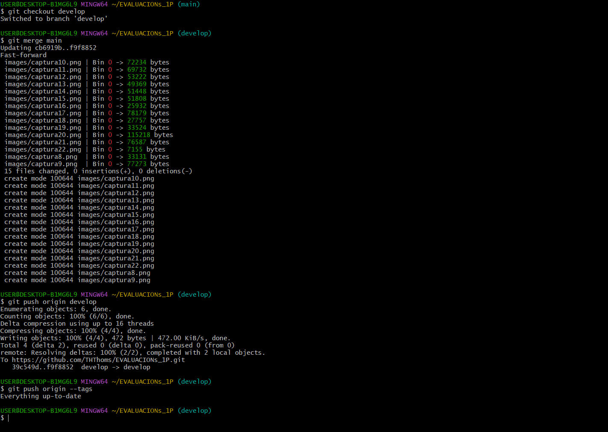